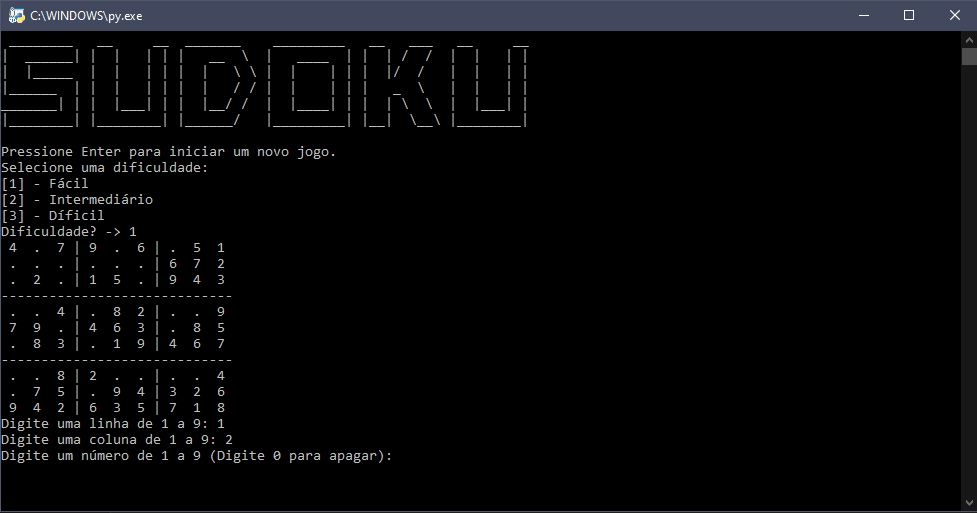

# College Work

## About
This repository is dedicated to programs I made for assessments and learning in college in various subjects. They are all programs developed in Python and are all commented and available in Portuguese and English. Please note that the translations into English were made with the help of AI, as the original programs were designed only for Portuguese and the manual translation process would be very time-consuming. So if you find any term that is incorrect or inappropriate, please open an issue to notify me. Below is a list of the programs and their descriptions.
## Programs
### Hangman Game

It was a work that had two phases, one where I had to make a functional hangman game in prompt and the words for the game had to be in a .txt file, and the second phase where I had to do the same thing but this time in a graphical interface, therefore an "improvement" of the original code. The .txt file used in both versions is the same. I did not provide a word file for the English game, but by following the rules that are commented in the code you can create your own word bank. The GUI versions require external images in the IMG folder.

### Sudoku

  
  

  
  

  
  

  
  

The Sudoku process was similar to that of the Hangman game, with the development of a program that works on a prompt and then the implementation of a graphical interface version. The program does not require external files.
